    

    <b>Automatic Architecture Diagrams from Code</b> 
    <a href="https://github.com/swark-io/swark">GitHub</a> • <a href="https://swark.io">Website</a> • <a href="mailto:contact@swark.io">Contact Us</a>

## Usage Instructions

1. **Render the Diagram**: Use the links below to open it in Mermaid Live Editor, or install the [Mermaid Support](https://marketplace.visualstudio.com/items?itemName=bierner.markdown-mermaid) extension.
2. **Recommended Model**: If available for you, use `claude-3.5-sonnet` [language model](vscode://settings/swark.languageModel). It can process more files and generates better diagrams.
3. **Iterate for Best Results**: Language models are non-deterministic. Generate the diagram multiple times and choose the best result.

## Generated Content
**Model**: GPT-4o - [Change Model](vscode://settings/swark.languageModel)  
**Mermaid Live Editor**: [View](https://mermaid.live/view#pako:eNp9lE1v4jAQhv-K5XO72gTa7XKoBDG0SMsKLfQ06cEkU4ia2JY_VkVV__s6CaFJSvY4z9jzzrye5J0mMkU6obHYa64OZMtiQYhxuzqcKlXGhKSZxsRmUpDtrCZT8Mlv1rw9k-vrezKDNd-jeT4lKxZBJAslBQrbTTB4lPK1y-awFBa9bKlSp1Cksej0U2kMdTQLfIkU36qmTiiEqbOHNhnBb2kX0om0TYO64QD-4N7XXGfJK-peMgSWmUT-RX3c1NK9AyNY6Mw3bX5lxvZyY3gyqFdc9fgNrHN-zP2FFRd-urNoWOdvYSF10YXzADZO8R03SKLcK57FRvWlHzDXWmri-1W--oCZn48z5OhlP4aNuOjAl9EHZ-4Oe3EKj-_gaUnmORattYru6sF_wsxZ-9nPCQff_WYoZ_s4gIjrtE9D2PLd0AZWizvkFwvAGXxAmcuEt3xhYclrK5uW2ahkJ7saNi5ZY86Z3pR0K_nZUnZbkqVZyV2WYwOD_y8Ha5an0e-G41b4dez2tzk0_YByVYxe0QJ1wbPU_2zeY2oP_v1iOiExTfGFu9zG9MMfcirlFlnGvVhBJ1Y7vKLcWbk5iqSJtXT7A5288Nzgxz-T2HxG) | [Edit](https://mermaid.live/edit#pako:eNp9lE1v4jAQhv-K5XO72gTa7XKoBDG0SMsKLfQ06cEkU4ia2JY_VkVV__s6CaFJSvY4z9jzzrye5J0mMkU6obHYa64OZMtiQYhxuzqcKlXGhKSZxsRmUpDtrCZT8Mlv1rw9k-vrezKDNd-jeT4lKxZBJAslBQrbTTB4lPK1y-awFBa9bKlSp1Cksej0U2kMdTQLfIkU36qmTiiEqbOHNhnBb2kX0om0TYO64QD-4N7XXGfJK-peMgSWmUT-RX3c1NK9AyNY6Mw3bX5lxvZyY3gyqFdc9fgNrHN-zP2FFRd-urNoWOdvYSF10YXzADZO8R03SKLcK57FRvWlHzDXWmri-1W--oCZn48z5OhlP4aNuOjAl9EHZ-4Oe3EKj-_gaUnmORattYru6sF_wsxZ-9nPCQff_WYoZ_s4gIjrtE9D2PLd0AZWizvkFwvAGXxAmcuEt3xhYclrK5uW2ahkJ7saNi5ZY86Z3pR0K_nZUnZbkqVZyV2WYwOD_y8Ha5an0e-G41b4dez2tzk0_YByVYxe0QJ1wbPU_2zeY2oP_v1iOiExTfGFu9zG9MMfcirlFlnGvVhBJ1Y7vKLcWbk5iqSJtXT7A5288Nzgxz-T2HxG)

```mermaid
graph TD
  subgraph App
    direction TB
    A[App.tsx] --> B[Pages]
    A --> C[Components]
    A --> D[Hooks]
    A --> E[Integrations]
  end

  subgraph Pages
    direction TB
    B1[Index.tsx]
    B2[Auth.tsx]
    B3[NotFound.tsx]
    B1 --> C1[RegionPicker]
    B1 --> C2[DiscoverySection]
    B1 --> C3[FriendsList]
    B1 --> C4[UserMap]
    B1 --> C5[PlaylistManager]
    B2 --> C6[Form]
    B2 --> E1[Supabase Client]
    B3 --> C7[Error Display]
  end

  subgraph Components
    direction TB
    C1[RegionPicker]
    C2[DiscoverySection]
    C3[FriendsList]
    C4[UserMap]
    C5[PlaylistManager]
    C6[Form]
    C7[Error Display]
    C8[UI Elements]
    C8 --> C9[Button]
    C8 --> C10[Input]
    C8 --> C11[Card]
    C8 --> C12[Tabs]
  end

  subgraph Hooks
    direction TB
    D1[useGeolocation]
    D2[useRegions]
    D3[useFriends]
    D4[usePlaylists]
    D5[useToast]
    D6[useIsMobile]
    D1 --> E1[Supabase Client]
    D2 --> E1
    D3 --> E1
    D4 --> E1
  end

  subgraph Integrations
    direction TB
    E1[Supabase Client]
  end
```

